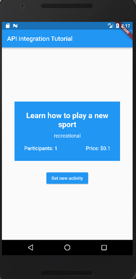

# Flutter API integration

A project to help introduce beginners to the use of APIs in Flutter.

## Getting Started

This project is a single-screen appication built with Flutter 3.3.1 as an educational material for beginners in flutter development who want to get a grasp of how to make API calls and use REST APIs in their projects.

The project illustrates how to make use of different data types in Dart as well as the following:
- Functions
- Asynchronous programming
- Object Oriented Programming
- Dart classes
- Flutter packages
- JSON data

The app uses the [HTTP](https://pub.dev/packages/http/) package to make network calls to the API and the data obtained is processed and displayed to the user.

- [Link to bored API](https://www.boredapi.com/)

Follow this [link](https://youtu.be/S58xWv9Zutw) to watch the video tutorial.

